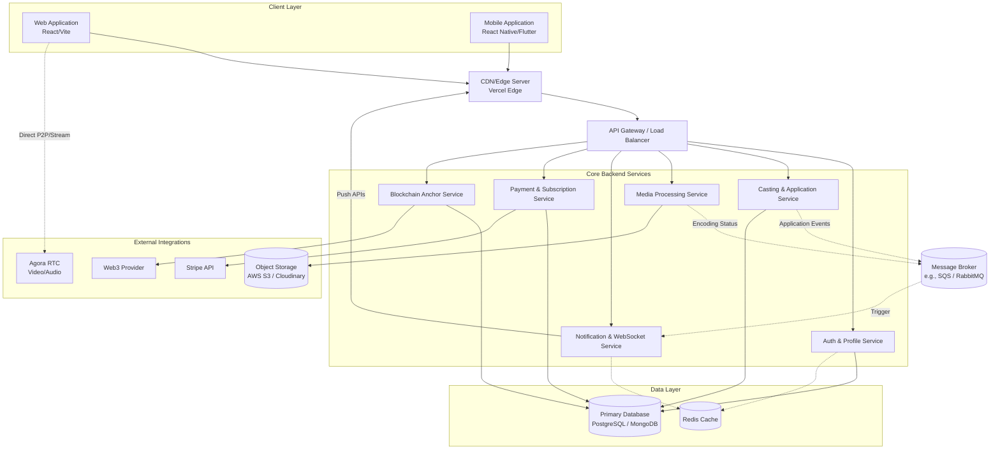
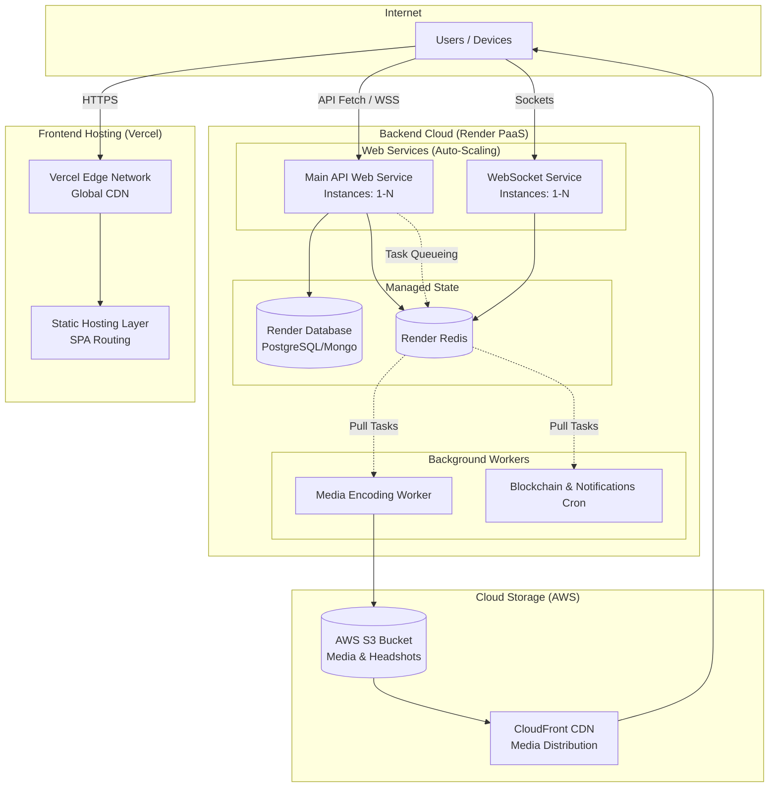
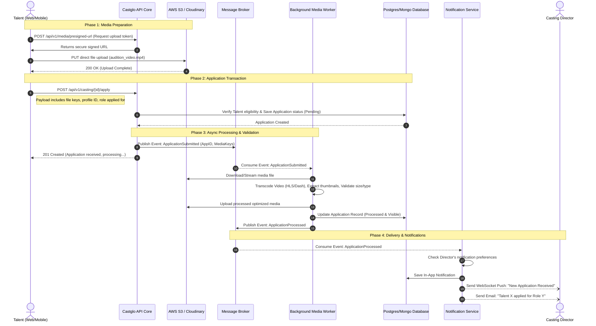

# Castglo Technical Architecture Review

This document provides a comprehensive technical breakdown of the Castglo platform's architecture based on the current implementation patterns, API specifications, and cloud deployment indicators.

---

## 1. High-Level System Architecture

The overarching design follows an event-driven, service-oriented architecture (SOA) to ensure scalability between the synchronous transactional operations (profiles, fetching jobs) and heavy asynchronous tasks (media processing, blockchain anchoring, real-time communications).

### Key Highlights:
- **Synchronous Workflows:** Core features like updating profiles (`PATCH /profile/me`), fetching jobs, and validating subscriptions happen synchronously with low latency, often leveraging the Redis cache layer.
- **Asynchronous Workflows:** Heavy operations like video uploads for auditions, triggering extensive email rounds (job recs), and anchoring to the blockchain operate through the Message Broker.
- **Real-time Engine:** WebSockets (`socket.io-client` in the frontend) and Agora RTC are heavily utilized for instant communications, messaging, and live auditions.

---

## 2. Cloud Deployment Architecture

Based on the environment configuration (`vercel.json`, `castglo-qupm.onrender.com`), the infrastructure leverages a hybrid PaaS approach. The frontend is heavily optimized at the edge, while backend workloads operate in scalable containerized environments.

### Scaling Profile:
- **Frontend Layer:** Handled entirely by Vercel's Edge CDN. Effectively infinite scaling for static assets.
- **Web API Layer:** Deployed as Render Web Services. Configured for horizontal auto-scaling based on CPU/Memory thresholds and concurrent request loads. Redis manages WebSocket pub/sub sessions across multiple instances.
- **Background Layer:** Background workers run as Render Background Worker instances, decoupled from HTTP traffic, allowing heavy audition conversions or bulk emails to scale independently without bottlenecking the main API.

---

## 3. Data Flow: Talent Applying to a Casting Call

This journey involves user interaction, heavy file uploading, database transactions, background processing, and notifications.

### Edge Cases & Error Handling:
1. **Media Upload Fails/Times Out:** The Pre-signed URL approach prevents the Web API from acting as a bottleneck. If direct S3 upload fails, client-side retry logic kicks in with resumable uploads.
2. **Worker Media Transcoding Fails:** If the uploaded file is corrupt, the worker updates the database application status to `Failed_Media`, triggering a WebSocket alert back to the Talent to "Re-upload Audition Media", without crashing the core API workflow.
3. **Database Concurrency:** If multiple talents apply exactly as slots run out (e.g., instant auditions), optimistic locking (`version` fields) on the database ensures consistency, rejecting the overflow with a clean `409 Conflict`.
