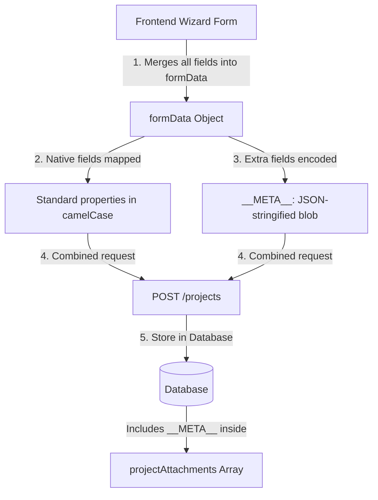

# Castglo Project & Casting Call Payload Specification

This document details the data architecture, form schemas, and API payloads for creating and updating projects (casting calls) and roles in the Castglo application. Use this reference to verify backend database mapping and troubleshoot issues with fields not saving.

---

## 1. Storage Architecture Overview

Castglo uses a **Hybrid Storage Model** to maintain flexibility between frontend representation and backend persistence:



### Key Principles:
1. **Core Database Fields**: Natively stored fields are mapped to standard camelCase database fields (e.g. `productionType`, `description`, `talentTypesNeeded`).
2. **Metadata Fields (`__META__`)**: Any snake_case form field that doesn't have a dedicated column in the backend is serialized into a single URL-encoded JSON string, prefixed with `__META__:`, and placed inside the `projectAttachments` array.
3. **Role Relationship**: Roles are stored in a separate table/collection. The frontend creates them sequentially via separate endpoints (`POST /projects/:id/roles`) once the project is created.
4. **Hydration**: When the frontend reads a project, it pulls the `__META__` string from the attachments, decodes it, and merges those values back into the frontend wizard state to reconstruct the form.

---

## 2. API Endpoint Mapping

| Action | HTTP Method | Endpoint | Payload Helper |
| :--- | :--- | :--- | :--- |
| **Create Project** | `POST` | `/projects` | `buildProjectPayload(formData)` |
| **Update Project** | `PATCH` | `/projects/:id` | `buildProjectPayload(formData)` |
| **Create Role** | `POST` | `/projects/:projectId/roles` | `buildRolePayload(role)` |
| **Update Role** | `PATCH` | `/projects/:projectId/roles/:roleId` | `buildRolePayload(role)` |

---

## 3. Project Creation Payload Spec

### Target: `POST /projects`
The payload contains the structured project fields merged with the serialized `__META__` data inside `projectAttachments`.

#### Request Schema:
```json
{
  "title": "string",
  "productionType": "string",
  "description": "string",
  "talentTypesNeeded": ["string"],
  "genre": ["string"],
  "productionCompany": "string",
  "personnel": ["string"],
  "payment": {
    "paidUnpaid": "paid | unpaid",
    "type": "fixed | hourly | daily",
    "amount": 0,
    "currency": "GBP | USD | EUR",
    "notes": "string"
  },
  "dates": {
    "submission": "YYYY-MM-DD"
  },
  "location": {
    "locationType": "Remote | On Location",
    "city": "string",
    "country": "string",
    "addressDetails": "string",
    "remote": "boolean"
  },
  "auditionRequired": "Yes | No",
  "interviewRequired": "Yes | No",
  "auditionType": "self-tape | zoom | in-person",
  "projectVideos": [],
  "status": "draft | active",
  "projectWebsite": "string",
  "directorBio": "string",
  "projectAttachments": [
    "__META__:<URL_ENCODED_JSON_STRING>",
    "cover_image_url"
  ]
}
```

#### Example Payload:
```json
{
  "title": "The Midnight Heist (Mock)",
  "productionType": "Film",
  "description": "A gripping action-thriller about a heist that spirals out of control in the heart of London.",
  "talentTypesNeeded": ["Actor", "Extra"],
  "genre": ["Action", "Thriller"],
  "productionCompany": "Mock Production Co",
  "personnel": ["Jane Doe", "John Doe", "Jane Smith"],
  "payment": {
    "paidUnpaid": "paid",
    "type": "fixed",
    "amount": 0,
    "currency": "GBP",
    "notes": "Rates variable by role"
  },
  "dates": {
    "submission": "2024-12-31"
  },
  "location": {
    "locationType": "on location",
    "city": "London, New York",
    "country": "Anywhere",
    "addressDetails": "London, UK (online option available)",
    "remote": false
  },
  "auditionRequired": "Yes",
  "interviewRequired": "No",
  "auditionType": "self-tape",
  "projectVideos": [],
  "status": "active",
  "projectWebsite": "https://midnightheist.example.com",
  "directorBio": "Directed by Jane Doe",
  "projectAttachments": [
    "__META__:%7B%22project_title%22%3A%22The%20Midnight%20Heist%20(Mock)%22%2C%22internal_project_reference%22%3A%22REF-2024-MH-001%22%2C%22casting_company_name%22%3A%22Mock%20Casting%20Co%22%2C%22production_company_name%22%3A%22Mock%20Production%20Co%22%2C%22project_status%22%3A%22Open%20for%20Applications%22%2C%22project_type%22%3A%22Film%22%2C%22genre%22%3A%5B%22Action%22%2C%22Thriller%22%5D%2C%22is_union_project%22%3Afalse...%7D",
    "https://res.cloudinary.com/demo/image/upload/v1234/sample.jpg"
  ]
}
```

---

## 4. Role Creation Payload Spec

### Target: `POST /projects/:projectId/roles`
Each role is sent as a distinct API request. Mapped properties are converted to camelCase.

#### Request Schema:
```json
{
  "name": "string",
  "roleType": "Lead | Supporting | Featured Extra | Extra | Voice Over | Presenter | Other",
  "status": "active | paused | closed",
  "ageRange": {
    "min": 18,
    "max": 35
  },
  "gender": "any | male | female | non-binary",
  "ethnicity": "any | visible_ethnicity_name",
  "skillsRequired": ["string"],
  "roleDescription": "string",
  "nudityRequired": "boolean",
  "mediaRequiredFromApplicants": ["string"],
  "locationRequirements": "string",
  "accentRequirements": "string",
  "languageRequirements": "string",
  "unionStatusRequirement": "string",
  "availabilityRequirement": "string",
  "preAudition": {
    "requestCustomVideo": "boolean",
    "requestCustomAudio": "boolean",
    "requestAdditionalMedia": "boolean",
    "sendMessage": "boolean",
    "questionsEnabled": "boolean",
    "deadline": "YYYY-MM-DD",
    "questions": [],
    "instructions": "string"
  }
}
```

#### Example Payload:
```json
{
  "name": "Lead Detective",
  "roleType": "Lead",
  "status": "active",
  "ageRange": {
    "min": 30,
    "max": 45
  },
  "gender": "Any",
  "ethnicity": "any",
  "skillsRequired": ["Stage Combat", "Driving"],
  "roleDescription": "Detective Morgan is a 10-year veteran of the Met who has seen it all. Requires strong dramatic range.",
  "nudityRequired": false,
  "mediaRequiredFromApplicants": ["Headshot", "Reel", "CV"],
  "locationRequirements": "London",
  "accentRequirements": "any",
  "languageRequirements": "English",
  "unionStatusRequirement": "Open to All",
  "availabilityRequirement": "Full availability required for shoot duration.",
  "preAudition": {
    "requestCustomVideo": true,
    "requestCustomAudio": false,
    "requestAdditionalMedia": false,
    "sendMessage": false,
    "questionsEnabled": false,
    "deadline": "2024-12-31",
    "questions": []
  }
}
```

---

## 5. Complete Frontend Form Fields List (`CastingFormData`)

If you need to define database columns or validators for all the wizard inputs, use the following field mapping:

### Step 1: Project Basics & Production Details
* `project_title` (`string`): Movie / project title.
* `internal_project_reference` (`string`): Internal code.
* `casting_company_name` (`string`): Audition manager name.
* `production_company_name` (`string`): Studio name.
* `project_status` (`string`): `"Draft" | "Open for Applications" | "Invite Only"`.
* `project_type` (`string`): Production type (e.g. `"Film"`, `"TV"`, `"Theatre"`).
* `genre` (`string[]`): Array of genres.
* `is_union_project` (`boolean`): Regulated by union?
* `union_details` (`string`): Guild guidelines.
* `project_website` (`string`): Website URL.
* `short_project_summary` (`string`): Quick tagline.
* `full_project_description` (`string`): Extended synopsis.
* `director_name` (`string`): Director.
* `producer_name` (`string`): Producer.
* `writer_name` (`string`): Writer.
* `casting_director_name` (`string`): Casting Director.
* `production_personnel` (`object[]`): Array of `{ name: string, role: string }`.
* `production_notes` (`string`): Extra logistics.
* `industry_areas` (`string[]`): Media sectors (e.g. `["Film", "Commercial"]`).
* `intended_audience_market` (`string`): Target age/demographic.

### Step 2: Talent Needed
* `talent_types_needed` (`string[]`): E.g. `["Actor", "Model", "Extra"]`.
* `role_scope` (`string`): `"Single Role" | "Multiple Roles"`.
* `total_number_of_roles` (`string`): Expected role count.
* `open_to_mixed_talent_categories` (`boolean`): True/False.
* `represented_talent_only` (`boolean`): True/False.
* `open_to_unrepresented_talent` (`boolean`): True/False.
* `talent_location_scope` (`string`): `"Local Only" | "Nationwide" | "International"`.
* `preferred_talent_base` (`string`): Geographic hub.
* `child_talent_involved` (`boolean`): Casting children.

### Step 3: Roles List (Array of Role Objects)
Each role object in the `roles` array has the following properties:
* `id` (`string`): Frontend temporary ID.
* `role_name` (`string`): Role title.
* `role_type` (`string[]`): E.g. `["Lead"]` or `["Supporting"]`.
* `role_status` (`string`): `"Draft" | "Open" | "Paused" | "Closed" | "Cast"`.
* `character_role_summary` (`string`): Brief breakdown.
* `full_role_description` (`string`): In-depth traits.
* `number_of_talents_needed` (`string`): Count.
* `featured_role` (`boolean`): True/False.
* `role_talent_types_needed` (`string[]`): Categories.
* `playing_age_range` (`string`): E.g. `"20-30"`.
* `minimum_age` (`string`): Default `"18"`.
* `maximum_age` (`string`): Default `"35"`.
* `gender` (`string[]`): E.g. `["Male"]`, `["Female"]`, `["Any"]`.
* `ethnicity` (`string[]`): Array of ethnicities.
* `open_to_all_ethnicities` (`boolean`): True/False.
* `height_range` (`string`): E.g. `"5'10\""`.
* `build_physical_type` (`string[]`): E.g. `["Athletic"]`.
* `languages_required` (`string[]`): Languages.
* `accents_required` (`string[]`): Accents.
* `skills_required` (`string[]`): E.g. `["Stunts", "Singing"]`.
* `preferred_skills` (`string[]`): Nice-to-haves.
* `professional_experience_required` (`boolean`): True/False.
* `experience_level_preferred` (`string`): `"Beginner" | "Intermediate" | "Professional"`.
* `union_status_required` (`string`): `"Union Only" | "Non-Union Only" | "Open to All"`.
* `driving_licence_required` (`boolean`): True/False.
* `passport_required` (`boolean`): True/False.
* `travel_required` (`boolean`): True/False.
* `speaking_role` (`boolean`): True/False.
* `singing_required` (`boolean`): True/False.
* `dancing_required` (`boolean`): True/False.
* `stunts_required` (`boolean`): True/False.
* `modelling_posing_required` (`boolean`): True/False.
* `hosting_presenting_required` (`boolean`): True/False.
* `intimacy_scene` (`boolean`): True/False.
* `nudity_required` (`boolean`): True/False.
* `nudity_type` (`string`): `"Partial" | "Full" | "To Be Discussed"`.
* `action_combat_required` (`boolean`): True/False.
* `safeguarding_conditions_apply` (`boolean`): True/False.
* `role_shoot_performance_location` (`string`): Base shoot location.
* `role_city` (`string`): City.
* `role_country` (`string`): Country (default: `"UK"`).
* `remote_option_available` (`boolean`): True/False.
* `rehearsal_dates` (`string`): Calendar details.
* `shoot_dates` (`string`): Shooting calendar.
* `performance_dates` (`string`): Shows calendar.
* `availability_requirement` (`string`): Schedule notes.
* `is_paid_role` (`boolean`): Paid/Unpaid.
* `payment_type` (`string`): E.g., `"Fixed Fee"`.
* `payment_amount` (`string`): Wage/salary amount.
* `currency` (`string`): E.g., `"GBP"`.
* `expenses_covered` (`boolean`): True/False.
* `accommodation_covered` (`boolean`): True/False.
* `travel_covered` (`boolean`): True/False.
* `compensation_notes` (`string`): Details on payment.

### Step 4: Application & Audition Settings
* `application_deadline` (`string`): Expiration date.
* `accept_until_role_filled` (`boolean`): Keep open.
* `who_can_apply` (`string`): `"Anyone on Castglo" | "Invited Talent Only"`.
* `invite_only` (`boolean`): True/False.
* `direct_invitations_enabled` (`boolean`): True/False.
* `castglo_matches_enabled` (`boolean`): True/False.
* `audition_required` (`boolean`): True/False.
* `audition_type` (`string`): `"Self-Tape Only" | "Zoom" | "In-person"`.
* `audition_date` (`string`): Audition schedule.
* `callback_date` (`string`): Callback schedule.
* `audition_location` (`string`): Address / Zoom Link.
* `audition_instructions` (`string`): Instructions context.
* `self_tape_accepted` (`boolean`): True/False.
* `self_tape_deadline` (`string`): Date.
* `live_online_audition_available` (`boolean`): True/False.
* `interview_required` (`boolean`): True/False.
* `interview_format` (`string`): `"Online" | "In-person" | "Phone"`.

### Step 5: Pre-Audition & Media Requirements
* `pre_audition_questions` (`object[]`): Question objects containing `{ title, type, required, options, help_text, sort_order }`.
* `project_cover_image` (`string | null`): Image URL.
* `additional_images` (`string[]`): Production design photos.
* `moodboard_references` (`string[]`): Moodboard reference URLs.
* `script_sides` (`string | null`): Script attachment URL.
* `director_producer_brief` (`string | null`): Brief PDF URL.
* `video_brief` (`string | null`): Video brief URL.
* `audio_brief` (`string | null`): Voice brief URL.
* `additional_attachments` (`string[]`): General files.
* `media_required` (`string[]`): E.g. `["Headshot", "Reel", "CV"]`.
* `custom_upload_requested` (`boolean`): True/False.
* `custom_upload_description` (`string`): Specific details.

### Step 6: Publishing & Review
* `visibility_level` (`string`): `"Public on Castglo" | "Private"`.
* `publish_immediately` (`boolean`): True/False.
* `save_as_draft` (`boolean`): True/False.
* `scheduled_publish_date` (`string`): Publish date.
* `featured_project` (`boolean`): Featured project add-on.
* `instant_posting_addon` (`boolean`): Moderate bypass add-on.
* `homepage_featured_addon` (`boolean`): Homepage promotion add-on.
* `priority_matching_addon` (`boolean`): Premium matching algorithm.
* `extend_listing_duration_addon` (`boolean`): Extended duration.
* `confirm_information_accurate` (`boolean`): Accuracy confirmation.
* `confirm_right_to_post` (`boolean`): Right to publish confirmation.
* `confirm_legal_safeguarding_compliance` (`boolean`): Safeguarding confirmation.
* `confirm_platform_policy` (`boolean`): Platform policy confirmation.

---

## 6. Troubleshooting Guidelines: Why Is Data Not Saving?

1. **`projectAttachments` is sanitized or stripped:** Ensure that the database model or serialization schema does not strip strings containing the `__META__:` prefix inside the `projectAttachments` array. This string stores all snake_case frontend-only configurations.
2. **Strict Zod/Joi schema checks:** If your backend schema defines `projectAttachments` strictly as an array of valid media URLs, it might reject or discard the `__META__:...` string because it is not a valid URL. Ensure the schema allows custom text values.
3. **Role IDs mismatch:** When updating, the frontend sends a `PATCH` request to `/projects/:id/roles/:roleId` for existing roles and a `POST` request to `/projects/:id/roles` for new ones. If the backend role router throws a `404` or does not map the IDs correctly, the roles will not update.
4. **Data types conversions:** The frontend converts input strings to numbers or booleans in several fields (like `ageRange.min` and `ageRange.max` in roles). Double check if any `null` or empty strings inside payloads trigger validation errors on the database side.
